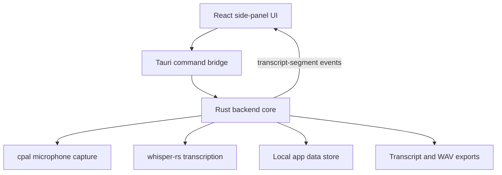
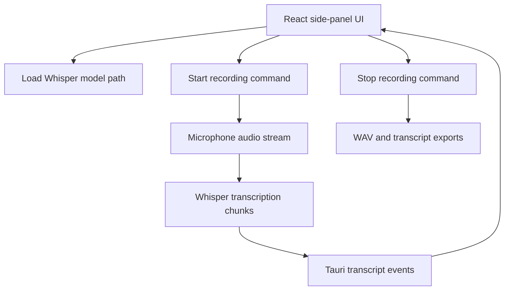

## Meetly Lite Architecture

Meetly Lite is generated at the workspace root. The reference project in `ref-meetily/` is read-only input and must not be modified.

## Current Implementation Slice

The current root implementation is a Vite and React frontend wrapped by a
Windows-first Tauri application. The backend is the Rust core under
`src-tauri/`, matching the supported architecture described in
`ref-meetily/docs/architecture.md`.

* Compact side-panel layout inspired by Microsoft Teams meeting panels
* Local meeting list and transcript list backed by Tauri commands
* Local Whisper model loading through `whisper-rs`
* Microphone capture through `cpal`
* Real-time transcript segment events emitted from Rust to React
* Local transcript and recording persistence through the Rust core
* Transcript and audio export controls backed by Rust commands
* No AI summary surface

## Backend Boundary

The active backend lives under `src-tauri/` at the workspace root. The older
Node.js file-store backend was removed because it did not perform native audio
capture or transcription.

## Validation Status

The following checks pass:

* `npm run build`
* `cargo check` from the VS 2022 Build Tools developer environment with `LIBCLANG_PATH` set to `C:\Program Files\LLVM\bin`

The remaining manual validation is a real recording and transcription run after
loading a local Whisper model file.

## Native Runtime Flow

## Removed From Scope

The lightweight version excludes these reference-project capabilities:

* AI-powered meeting summaries
* Summary templates and editor workflow
* Ollama, Claude, Groq, OpenRouter, OpenAI-compatible, and built-in summary providers
* macOS and Linux support paths as product targets
