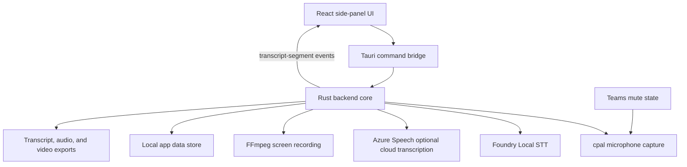
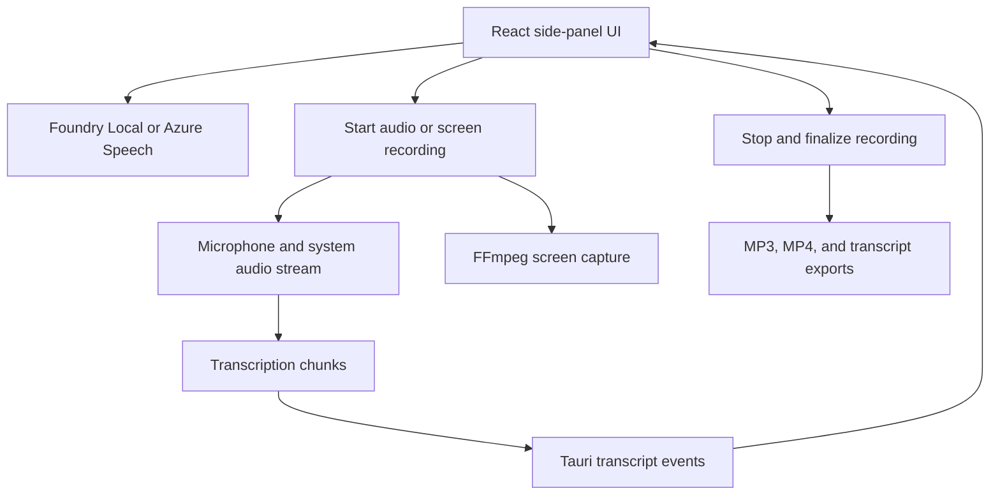

Meetly Lite is generated at the workspace root. The reference project in `ref-meetily/` is read-only input and must not be modified.

## Features

* Compact side-panel transcription UI inspired by Microsoft Teams meeting panels
* Rust/Tauri recording control flow
* Foundry Local model discovery and on-device speech-to-text
* WebRTC VAD for local transcription
* Optional Azure Speech live recognition and Fast Transcription for selected WAV, MP3, and MP4 files
* Selectable microphone input capture through `cpal`
* Simultaneous microphone and system audio capture with mixed recording output
* Capture modes for microphone only, system audio only, or microphone plus system audio
* Microsoft Teams mute-state synchronization on Windows 11
* Per-session transcription language selection
* Transcript segments emitted from Rust to the UI through Tauri events
* Local meeting and transcript history stored under the app data directory
* Transcript export as `.txt` and recorded audio export in the stored file format
* Recorded audio playback with per-transcript-segment navigation
* Desktop and user-selected-area screen recording with FFmpeg H.264 or H.265 encoding
* Local video catalog, export folder selection, and incomplete-recording recovery
* Optional GitHub Copilot recap, evidence-linked action items, and meeting chat
* Optional Azure Fast speaker diarization with user-assigned speaker names

## Meeting intelligence and timing (2026-09-08)

The saved PCM sample timeline is authoritative for playback. Capture packets use
a common clock; one mixer supplies both disk recording and transcription. Stateful
resampling preserves fractional phase. Azure recognizer-relative offsets map through
the first delivered PCM anchor, including after language changes and reconnects.
Foundry language is snapshotted at utterance enqueue. Canonical locales are applied
without changing global defaults when editing an existing meeting.

The assistant uses the pinned official Rust Copilot SDK and bundled runtime over
stdio. Empty runtime mode, disabled tools/config discovery, isolated temporary
storage, bounded requests, and validated transcript references limit its access.
Assistant history and task completion are stored separately per meeting and removed
when that meeting is deleted. No summary or status request runs automatically.
Final validated answers are displayed rather than unvalidated token streaming.

The docked conversation pane defaults to Chat with a fixed composer and independent
history scroll. Recording does not disable inference. Each request captures a
server-owned confirmed-transcript snapshot; ordered-prefix integrity permits new
segments but rejects changes to existing evidence or meeting metadata. Recording
bookkeeping (duration, path, updatedAt, hasAudio) is excluded from the prefix proof.
Assistant-only file locks remain held across inference; the Store mutex is held
only briefly for snapshots and final validation/commit, so recording can append.
Optional version-1 storage fields preserve snapshot coverage and integrity. Legacy
history is reused only on exact fingerprint equality; unsafe history is omitted
without deleting displayed messages or forcing recap generation.

Azure re-transcription and diarization explicitly disclose audio upload and charges,
and always create a new result. An anonymous speaker ID is not a person's identity;
the user assigns display names. Changing the language of completed text edits its
metadata only; it does not translate or re-transcribe it.

## Current Implementation Slice

The current root implementation is a Vite and React frontend wrapped by a
Windows-first Tauri application. The backend is the Rust core under
`src-tauri/`, matching the supported architecture described in
`ref-meetily/docs/architecture.md`.

## Backend Boundary

The active backend lives under `src-tauri/` at the workspace root. The older
Node.js file-store backend was removed because it did not perform native audio
capture or transcription.



Foundry Local is the only local model runtime. WebRTC VAD provides
utterance-based chunking and speech gating for fixed five-second chunks.

Microphone-enabled recordings read the active Teams call mute state. Muted
microphone frames are replaced with equal-length silence so recording and
transcript timing remain synchronized.

## Development

```powershell
npm install
npm run build
npm run tauri:dev
```

Build the Windows desktop app:

```powershell
npm run tauri:build
```

Rust validation does not require LLVM, libclang, or a separate CMake
installation:

```powershell
cargo check --manifest-path src-tauri\Cargo.toml
cargo test --manifest-path src-tauri\Cargo.toml --lib
```

The default desktop build outputs under `src-tauri\target\release`.

## Foundry Local Models

1. Open **Settings**.
2. Select **Foundry Local** as the transcription engine.
3. Select **Refresh** to load compatible speech models from the catalog.
4. Choose a model alias.
5. Select **Download / prepare** to cache the model and execution providers.
6. Start recording.

Downloads are explicit. Once prepared, inference runs locally without Azure
credentials.

## Native Backend Commands

The root Tauri backend provides these commands to the frontend:

* `get_meetings`
* `refresh_meetings`
* `get_videos`
* `refresh_videos`
* `delete_video`
* `rename_video`
* `get_recording_runtime_status`
* `list_audio_input_devices`
* `list_audio_output_devices`
* `list_screen_targets`
* `open_area_selector`
* `complete_area_selection`
* `cancel_area_selection`
* `select_video_output_folder`
* `select_ffmpeg_executable`
* `open_video_recordings_folder`
* `get_settings`
* `save_settings`
* `start_recording`
* `stop_recording`
* `start_screen_recording`
* `stop_screen_recording`
* `select_fast_transcription_audio`
* `transcribe_fast_audio`
* `add_transcript_segment`
* `get_azure_cli_access_token`
* `sign_in_azure_cli`
* `check_azure_cli_sign_in`
* `list_foundry_local_models`
* `download_foundry_local_model`
* `rename_meeting`
* `update_meeting_language`
* `delete_meeting`
* `export_transcript`
* `export_audio`
* `open_meeting_folder`
* `play_recording`
* `pause_playback`
* `resume_playback`
* `set_mini_mode`

## Validation Status

The following checks pass:

* `npm run build`
* `cargo check --manifest-path src-tauri\Cargo.toml`
* `cargo test --manifest-path src-tauri\Cargo.toml --lib`

## Azure Speech Fast Transcription

Fast Transcription accepts one WAV, MP3, or MP4 file. Before upload, the native
backend validates the file type, a 250 MB maximum file size, and a two-hour
maximum duration. It accepts only an HTTPS Azure Cognitive Services custom
domain endpoint and disables redirects before sending the bearer token.

MP4 input is converted locally to a temporary MP3 through the configured FFmpeg
runtime. The temporary file is removed after the request completes. Meetly sends
audio directly to Azure Speech and does not use Azure Blob Storage, storage
account keys, or SAS URLs. Azure CLI obtains the Microsoft Entra access token;
the signed-in identity needs the `Cognitive Services User` role on the Speech
resource.

After Azure Speech returns timestamped phrases, Meetly stores the transcript and
a local copy of the submitted audio as a meeting. The UI reports validation,
upload, transcription, and saving stages while the synchronous request runs.

## Screen Recording Finalization and Recovery

Screen recording uses FFmpeg to create a fragmented `.partial.mp4` in the
configured output directory. When the selected capture mode includes audio,
native audio capture stages a WAV file in the system temporary directory.

Recorded videos can be renamed from the video list. `rename_video` updates the
catalog title and `updatedAt` timestamp in the local store without renaming the
completed MP4 file on disk.

H.264 and H.265 output uses `yuv420p`, so the backend normalizes selected-area
dimensions to even values. On stop, the backend stops FFmpeg and audio capture,
muxes staged audio when available, validates the completed output, then renames
the result to its final `.mp4` file. It emits `screen-processing-status` events
for the processing stages.

At startup and before `refresh_videos` reads the output directory, Meetly retries
inactive incomplete recordings with a nonempty partial MP4. Empty partial files
are marked as capture failures. Intermediate `.partial.mp4` and `.muxing.mp4`
files are not imported into the saved-video catalog.

## Audio Encoding Recovery

Meeting recordings are first finalized as WAV files and then encoded to MP3. If
encoding fails or the app closes before the conversion completes, the WAV stays
associated with the meeting. At the next app startup, Meetly retries conversion
for persisted non-file-transcription WAV recordings. It updates the meeting to
the MP3 path and deletes the WAV only after the updated store is written.

## Native Runtime Flow



## Removed From Scope

The lightweight version excludes these reference-project capabilities:

* AI-powered meeting summaries
* Summary templates and editor workflow
* Ollama, Claude, Groq, OpenRouter, OpenAI-compatible, and built-in summary providers
* macOS and Linux support paths as product targets
