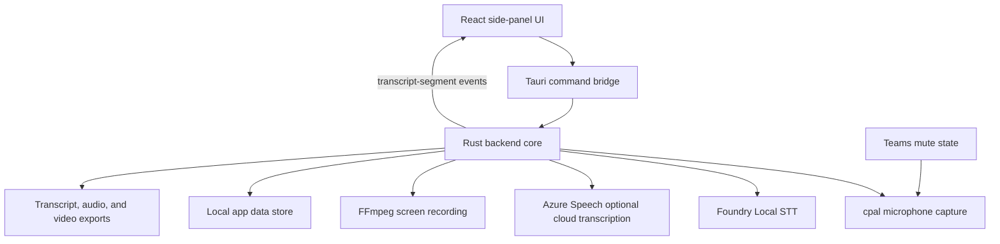
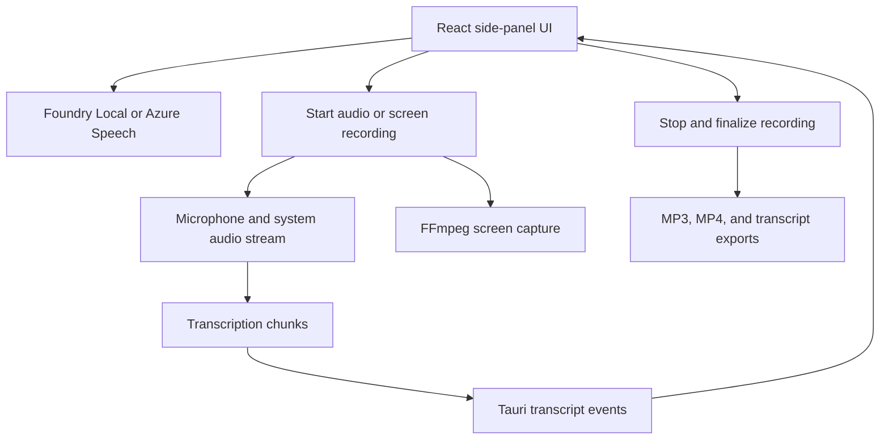

Meetly Lite lives at the workspace root. The reference project in `ref-meetily/` is read-only input and must not be modified.

## Features

* Compact side-panel transcription UI inspired by Microsoft Teams meeting panels
* Rust/Tauri recording control flow
* Foundry Local model discovery and on-device speech-to-text
* WebRTC VAD for local transcription
* Optional Azure Speech live recognition and Fast Transcription for selected WAV, MP3, and MP4 files
* Selectable microphone input capture through `cpal`
* Simultaneous microphone and system audio capture with mixed recording output
* Capture modes for microphone only, system audio only, or microphone plus system audio
* Microsoft Teams mute-state synchronization on Windows 11
* Per-session transcription language selection
* Transcript segments emitted from Rust to the UI through Tauri events
* Local meeting and transcript history stored under the app data directory
* Transcript export as `.txt` and recorded audio export in the stored file format
* Recorded audio playback with per-transcript-segment navigation
* Desktop and user-selected-area screen recording with FFmpeg H.264 or H.265 encoding
* Local video catalog, export folder selection, and incomplete-recording recovery
* Optional GitHub Copilot recap, evidence-linked action items, and meeting chat
* Optional Azure Fast speaker diarization with user-assigned speaker names

## Meeting intelligence and timing

### Audio timeline

One clock and mixer supply both recording and transcription, keeping timestamps
aligned with saved audio. Stateful resampling preserves fractional samples. Azure
offsets are anchored to delivered PCM after reconnects or language changes; Foundry
captures the language when each utterance is queued.

Recording devices remain paused until metadata and the dedicated WAV writer
thread are ready. The capture clock begins when streams are started, so slow
setup does not consume the two-second per-source buffer or add startup silence.
WAV writes and finalization do not run on the shared async executor. Genuine
capture overflow or disk failure still stops recording and retains recovery audio.

WASAPI's first callback timestamp can be zero while the packet's capture timestamp
is valid system QPC time. The shared anchor uses the later of those timestamps at
the observed elapsed time, not zero/system boot time. Subsequent packets retain
capture-time deltas (including real pauses and late delivery). Impossible future
jumps beyond 250 ms stop capture rather than generating hours of invalid silence.

Azure shutdown closes the owned push stream, waits for end-of-input results and
transcript persistence, then disposes the recognizer. It does not redundantly close
the AudioConfig wrapper. Real drain/disposal errors remain visible.

Opening an idle saved meeting is a local view change with no native runtime-query
wait. Selection reveals the meeting workspace even when the same meeting ID is
already selected beneath Settings or another workspace. Startup reconciliation
remains responsible for restoring a native session; settings/device initialization
alone is not a recording.

Active capture and stale capture references use guarded native status checks and
serialized cleanup before switching meetings. Start/stop transitions block a switch
to another meeting, stale selection responses are ignored, and status-query failures
preserve live capture. UI Stop callbacks take no arguments, while internal failure
cleanup is bound to a recording attempt so stale events cannot stop a replacement
session.

### Meeting Assistant

* **Runtime:** the pinned Copilot Rust SDK uses a bundled runtime over stdio, with
	isolated temporary storage and tools and ambient configuration discovery disabled.
* **Account and model:** explicit status checks discover models for the selected
	account. Inference uses that account too, without switching the global GitHub CLI
	login. Opening the pane never checks status or generates answers automatically.
* **Live context:** each submission snapshots confirmed transcript text. New speech
	is allowed while an answer is pending; edits to its evidence invalidate the result.
	Unsafe history is excluded from later requests without deleting saved messages.
* **Validation:** answers appear only after validation. Inline timestamp citations
	resolve through saved, field-specific source lists; legacy references are not guessed.
* **Storage and locking:** assistant history is separate from the meeting store.
	A per-meeting file lock spans inference; the Store mutex is held only for snapshot
	reads and final validation/commit, allowing recording to continue.
* **Clear session:** confirmation removes only that meeting's assistant history,
	recap, actions and completion state. Audio and transcripts remain intact; clearing
	is rejected while the assistant lock is held. Deleting a meeting also removes its
	assistant data.

### Re-transcription and speakers

Azure re-transcription requires explicit audio-upload consent and creates a new
meeting, preserving the original. Speaker IDs are anonymous labels, not verified
identities. Editing a saved meeting's language changes metadata only.

## Application Structure

The current root implementation is a Vite and React frontend wrapped by a
Windows-first Tauri application. The backend is the Rust core under
`src-tauri/`, matching the supported architecture described in
`ref-meetily/docs/architecture.md`.

## Backend Boundary

The active backend lives under `src-tauri/` at the workspace root and owns native
capture, local persistence, and recording lifecycle commands.



Foundry Local is the only local model runtime. WebRTC VAD provides
utterance-based chunking and speech gating for fixed five-second chunks.

Microphone-enabled recordings read the active Teams call mute state. Muted
microphone frames are replaced with equal-length silence so recording and
transcript timing remain synchronized.

## Development

```powershell
npm install
npm run build
npm run tauri:dev
```

Build the Windows desktop app:

```powershell
npm run tauri:build
```

Rust validation does not require LLVM, libclang, or a separate CMake
installation:

```powershell
cargo check --manifest-path src-tauri\Cargo.toml
cargo test --manifest-path src-tauri\Cargo.toml --lib
```

The default desktop build outputs under `src-tauri\target\release`.

## Foundry Local Models

1. Open **Settings**.
2. Select **Foundry Local** as the transcription engine.
3. Select **Refresh** to load compatible speech models from the catalog.
4. Choose a model alias.
5. Select **Download / prepare** to cache the model and execution providers.
6. Start recording.

Downloads are explicit. Once prepared, inference runs locally without Azure
credentials.

## Native Backend Commands

The root Tauri backend provides these commands to the frontend:

* `get_meetings`
* `refresh_meetings`
* `get_videos`
* `refresh_videos`
* `delete_video`
* `rename_video`
* `get_recording_runtime_status`
* `list_audio_input_devices`
* `list_audio_output_devices`
* `list_screen_targets`
* `open_area_selector`
* `complete_area_selection`
* `cancel_area_selection`
* `select_video_output_folder`
* `select_ffmpeg_executable`
* `open_video_recordings_folder`
* `get_settings`
* `save_settings`
* `start_recording`
* `stop_recording`
* `start_screen_recording`
* `stop_screen_recording`
* `select_fast_transcription_audio`
* `transcribe_fast_audio`
* `add_transcript_segment`
* `get_azure_cli_access_token`
* `sign_in_azure_cli`
* `check_azure_cli_sign_in`
* `list_foundry_local_models`
* `download_foundry_local_model`
* `rename_meeting`
* `update_meeting_language`
* `delete_meeting`
* `export_transcript`
* `export_audio`
* `open_meeting_folder`
* `play_recording`
* `pause_playback`
* `resume_playback`
* `set_mini_mode`

## Azure Speech Fast Transcription

Fast Transcription accepts one WAV, MP3, or MP4 file. Before upload, the native
backend validates the file type, a 250 MB maximum file size, and a two-hour
maximum duration. It accepts only an HTTPS Azure Cognitive Services custom
domain endpoint and disables redirects before sending the bearer token.

MP4 input is converted locally to a temporary MP3 through the configured FFmpeg
runtime. The temporary file is removed after the request completes. Meetly sends
audio directly to Azure Speech and does not use Azure Blob Storage, storage
account keys, or SAS URLs. Azure CLI obtains the Microsoft Entra access token;
the signed-in identity needs the `Cognitive Services User` role on the Speech
resource.

After Azure Speech returns timestamped phrases, Meetly stores the transcript and
a local copy of the submitted audio as a meeting. The UI reports validation,
upload, transcription, and saving stages while the synchronous request runs.

## Screen Recording Finalization and Recovery

Screen recording uses FFmpeg to create a fragmented `.partial.mp4` in the
configured output directory. When the selected capture mode includes audio,
native audio capture stages a WAV file in the system temporary directory.

Recorded videos can be renamed from the video list. `rename_video` updates the
catalog title and `updatedAt` timestamp in the local store without renaming the
completed MP4 file on disk.

H.264 and H.265 output uses `yuv420p`, so the backend normalizes selected-area
dimensions to even values. On stop, the backend stops FFmpeg and audio capture,
muxes staged audio when available, validates the completed output, then renames
the result to its final `.mp4` file. It emits `screen-processing-status` events
for the processing stages.

At startup and before `refresh_videos` reads the output directory, Meetly retries
inactive incomplete recordings with a nonempty partial MP4. Empty partial files
are marked as capture failures. Intermediate `.partial.mp4` and `.muxing.mp4`
files are not imported into the saved-video catalog.

## Audio Encoding Recovery

Meeting recordings are first finalized as WAV files and then encoded to MP3. If
encoding fails or the app closes before the conversion completes, the WAV stays
associated with the meeting. At the next app startup, Meetly retries conversion
for persisted non-file-transcription WAV recordings. It updates the meeting to
the MP3 path and deletes the WAV only after the updated store is written.

## Native Runtime Flow



## Scope Exclusions

The lightweight version excludes these reference-project capabilities:

* Summary templates and editor workflow
* Direct Ollama, Claude, Groq, OpenRouter, OpenAI-compatible, and built-in summary providers (models exposed through GitHub Copilot remain supported)
* macOS and Linux support paths as product targets
