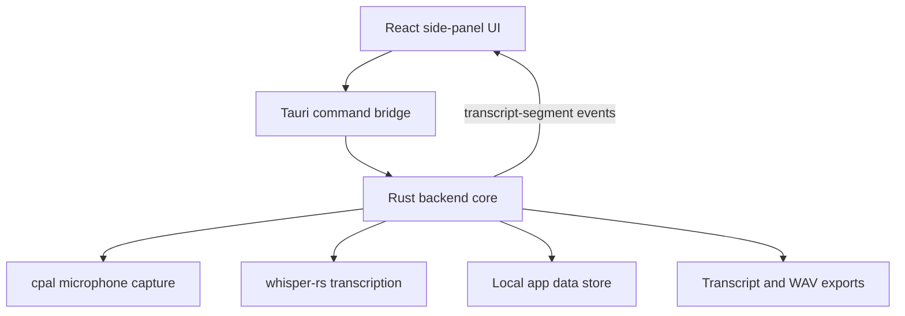
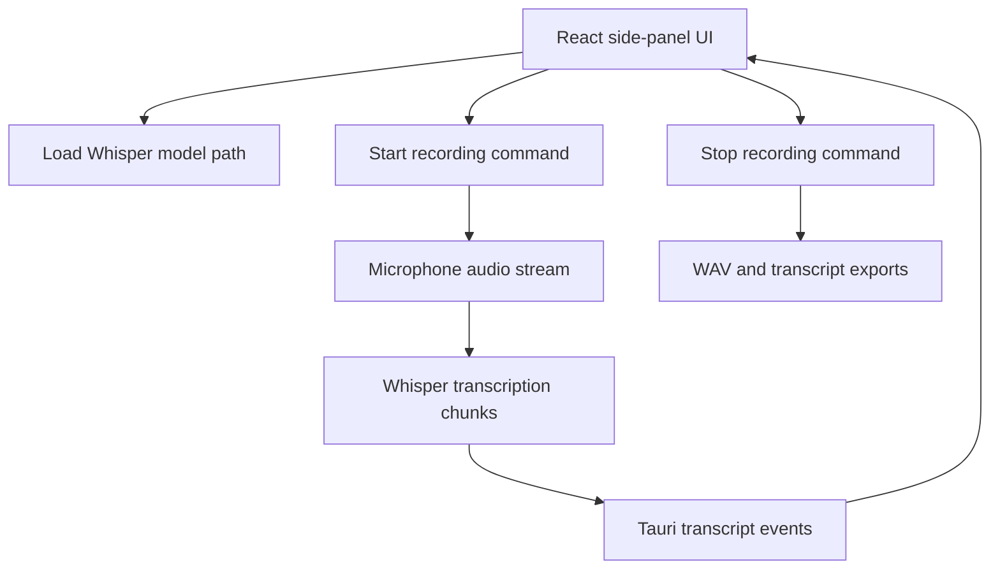

## Meetly Lite Architecture

Meetly Lite is generated at the workspace root. The reference project in `ref-meetily/` is read-only input and must not be modified.

## Features

* Compact side-panel transcription UI inspired by Microsoft Teams meeting panels
* Rust/Tauri recording control flow
* Local Whisper model loading through `whisper-rs`
* Selectable microphone input capture through `cpal`
* Simultaneous microphone and system audio capture with mixed recording output
* Capture modes for microphone only, system audio only, or microphone plus system audio
* Per-session Whisper transcription language selection
* Azure Speech for optional live recognition and Fast Transcription of one saved WAV, MP3, or MP4 file
* Separate Windows screen recording for an entire desktop or fixed area with H.264 or H.265 MP4 encoding
* Screen recording mini mode with capture controls, audio meters, and processing status
* Durable video finalization with automatic recovery of incomplete recordings
* Transcript segments emitted from Rust to the UI through Tauri events
* Local meeting and transcript history stored under the app data directory
* Transcript export as `.txt` and recorded audio export as `.wav` or `.mp3`
* Recorded audio playback with per-transcript-segment navigation
* Optional build-time Whisper acceleration for CUDA or Vulkan
* No AI summary workflow

## Current Implementation Slice

The current root implementation is a Vite and React frontend wrapped by a
Windows-first Tauri application. The backend is the Rust core under
`src-tauri/`, matching the supported architecture described in
`ref-meetily/docs/architecture.md`.

## Backend Boundary

The active backend lives under `src-tauri/` at the workspace root. The older
Node.js file-store backend was removed because it did not perform native audio
capture or transcription.



## Development

Install dependencies:

```powershell
npm install
```

Run the web frontend only:

```powershell
npm run dev
```

Run the Tauri desktop app:

```powershell
npm run tauri:dev
```

Frontend build validation:

```powershell
npm run build
```

Rust backend validation from a VS 2022 Build Tools developer environment:

```powershell
cmd.exe /c 'call "%ProgramFiles(x86)%\Microsoft Visual Studio\2022\BuildTools\VC\Auxiliary\Build\vcvars64.bat" && set "LIBCLANG_PATH=%ProgramFiles%\LLVM\bin" && set "PATH=%ProgramFiles%\CMake\bin;%ProgramFiles%\LLVM\bin;%PATH%" && cd /d "%CD%\src-tauri" && cargo check'
```

The Rust core stores app data in the OS app-data directory selected by Tauri.

## Production

Build the Windows desktop app:

```powershell
npm install
npm run tauri:build
```

Build with automatic Whisper acceleration detection:

```powershell
npm run tauri:build:gpu
```

Build with a specific Whisper backend:

```powershell
npm run tauri:build:cuda
npm run tauri:build:vulkan
```

GPU acceleration is selected at build time. It is not a runtime setting in the app.
Use `cuda` for NVIDIA GPUs with CUDA Toolkit installed, and `vulkan` for supported
GPU drivers with Vulkan tooling. You can also set `TAURI_GPU_FEATURE` to
`cuda` or `vulkan` before running `npm run tauri:build:gpu`.
GPU builds use a short Cargo target directory at the project drive root (`<drive>:\mtg`), and
prefer the Ninja CMake generator bundled with Visual Studio Build Tools to avoid
Windows path-length and MSBuild FileTracker failures in generated Whisper/Vulkan
CMake files.

The default `npm run tauri:build` creates these files:

* `src-tauri/target/release/meetly-lite.exe`
* `src-tauri/target/release/bundle/nsis/Meetly Lite_0.1.0_x64-setup.exe`
* `src-tauri/target/release/bundle/msi/Meetly Lite_0.1.0_x64_en-US.msi`

GPU builds (`tauri:build:gpu`, `tauri:build:cuda`, and `tauri:build:vulkan`) redirect the Cargo target directory to `<drive>:\mtg`, so their
output lands here instead:

* `<drive>:\mtg\release\meetly-lite.exe`
* `<drive>:\mtg\release\bundle\nsis\Meetly Lite_0.1.0_x64-setup.exe`
* `<drive>:\mtg\release\bundle\msi\Meetly Lite_0.1.0_x64_en-US.msi`

Install or run a GPU build from `<drive>:\mtg`. GPU builds never update the
`src-tauri/target/release` files, so those paths keep stale code from an earlier
default build. Running the old `src-tauri/target/release/meetly-lite.exe` after a
GPU build is the most common cause of "my changes did not take effect."

Use the installer for normal testing. Running the raw `meetly-lite.exe` also
works, but it does not install shortcuts or app metadata.

## Whisper Model Files

The executable does not bundle a Whisper model. Download or copy a local
`ggml-*.bin` model file and load it from the app settings with an absolute path.

Download models from the official whisper.cpp model hosting location:

* <https://huggingface.co/ggerganov/whisper.cpp/tree/main>

Recommended starter models:

* `ggml-base.en.bin` for English-only testing with a small download size
* `ggml-base.bin` for multilingual testing
* `ggml-small.en.bin` for better English accuracy when you can use more CPU and disk

Create a local model folder and place the downloaded file there:

```powershell
New-Item -ItemType Directory -Force "$HOME\models"
```

Example model path:

```text
%USERPROFILE%\models\ggml-base.en.bin
```

The file must meet these conditions:

* It exists on the local machine.
* It is a file, not a folder.
* It has a `.bin` extension.
* It is a Whisper `ggml` model compatible with `whisper.cpp`.

If model loading fails in the executable, check the exact path first. The app
does not resolve paths relative to the executable directory. Use the full path
shown in File Explorer.

## Recommended Verification Flow

1. Install or run the built desktop app.
2. Open `Settings`.
3. Select `Browse` next to `Whisper Model Path`.
4. Choose the downloaded `ggml-*.bin` model file.
5. Select `Load Model`.
6. Choose the capture mode, microphone input, system audio output, and session language.
7. Use the floating audio-record control to start a meeting recording.

Do not use `npm run dev` to test model loading. The browser-only Vite preview
cannot call Tauri native commands and cannot load Whisper models.

## Native Backend Commands

The root Tauri backend provides these commands to the frontend:

* `get_meetings`
* `refresh_meetings`
* `list_audio_input_devices`
* `list_audio_output_devices`
* `get_videos`
* `refresh_videos`
* `list_screen_targets`
* `open_area_selector`
* `complete_area_selection`
* `cancel_area_selection`
* `select_video_output_folder`
* `select_ffmpeg_executable`
* `open_video_recordings_folder`
* `load_whisper_model`
* `select_whisper_model`
* `get_whisper_model_status`
* `get_settings`
* `save_settings`
* `start_recording`
* `stop_recording`
* `start_screen_recording`
* `stop_screen_recording`
* `select_fast_transcription_audio`
* `transcribe_fast_audio`
* `add_transcript_segment`
* `get_azure_cli_access_token`
* `sign_in_azure_cli`
* `check_azure_cli_sign_in`
* `rename_meeting`
* `update_meeting_language`
* `delete_meeting`
* `export_transcript`
* `export_audio`
* `open_meeting_folder`
* `play_recording`
* `pause_playback`
* `resume_playback`
* `set_mini_mode`

## Validation Status

The following checks pass:

* `npm run build`
* `cargo check` from the VS 2022 Build Tools developer environment with `LIBCLANG_PATH` set to `C:\Program Files\LLVM\bin`

The remaining manual validation is a real recording and transcription run after
loading a local Whisper model file.

## Azure Speech Fast Transcription

File transcription uses the synchronous Azure Speech Fast Transcription REST
endpoint. The native backend validates WAV, MP3, or MP4 input, a 250 MB maximum
file size, and a two-hour maximum duration before it sends a multipart request.
It accepts only an HTTPS root URL whose host is an Azure Cognitive Services
custom domain. Redirects are disabled so the bearer token cannot leave that
host. The upload streams from disk and uses connection and total operation
deadlines. Azure CLI obtains the Microsoft Entra token, and the signed-in
identity must have the `Cognitive Services User` role on the Speech resource.
Tenant and subscription identifiers accept only Azure identifier characters
before they are forwarded through the Windows Azure CLI launcher, preventing
shell metacharacters from reaching `cmd.exe`.

MP4 input is converted locally to a guarded temporary MP3 before upload. That
conversion is managed by the configured FFmpeg runtime, not Azure Speech. The
temporary file is removed on success or failure. Audio is sent directly to the
configured custom-domain Azure Speech endpoint. Azure Blob Storage, storage
account keys, and SAS URLs are not part of this flow. After Azure Speech returns
timestamped phrases, Meetly copies the source audio into its local recordings
directory and stores the transcript as a normal meeting for playback and
export. The final audio copy remains guarded until metadata commits.

The Fast Transcription service returns a final result synchronously. The UI
therefore shows local stages, validation, upload, transcription, and saving,
rather than a server-provided completion percentage. Its completion-time value
is an estimate calculated from the source duration.

## Screen Recording Finalization and Recovery

Screen recording uses FFmpeg `gdigrab` to create a fragmented `.partial.mp4`
in the configured output directory. For recording modes that include audio, the
native audio capture writes a WAV file under the private temporary path
`%TEMP%\MeetlyLite\screen-audio`. The persisted `VideoRecording` metadata keeps
the temporary video path, staged audio path, and status.

The H.264 and H.265 paths encode `yuv420p`, which requires even frame width and
height. The backend rounds a selected area down by one pixel per odd dimension
before it creates the `ScreenTarget`, and applies the same normalization when a
recording starts. After it spawns FFmpeg, it watches briefly for an immediate
exit. If the encoder fails to start, for example because of an invalid frame
size, it returns the FFmpeg diagnostics and rolls back the staged assets rather
than reporting an active recording. FFmpeg diagnostics are drained on a
background thread and kept as a bounded tail.

When `stop_screen_recording` runs, the backend follows this sequence:

1. Send FFmpeg the `q` command and wait for the process to exit. A closed input
  pipe is accepted when FFmpeg has already stopped.
2. Stop and join the audio capture thread.
3. Mux the temporary MP4 and WAV into a separate `.muxing.mp4` output when
  audio was captured.
4. Validate the completed video through FFmpeg.
5. Rename the validated output to the final `.mp4`, then remove the temporary
  source video and staged WAV.

The backend emits `screen-processing-status` events for stopping capture,
mixing audio, validating the recording, and saving the final file. React uses
these events in both the full screen-recording workspace and screen mini mode.
The video list labels recordings as ready, recording, processing, recovery
pending, or capture failed. Fast Transcription is available only when the video
status is saved.

If any finalization step fails, the backend preserves the partial MP4 and WAV
and sets the video status to `post-processing-failed`. At startup and before
`refresh_videos` reads the output folder, the backend retries every inactive
incomplete recording that still has video data. A zero-byte partial MP4 cannot
be recovered because FFmpeg encoded no video frames, so the backend labels it
`capture-failed` and does not retry it. Intermediate `.partial.mp4` and
`.muxing.mp4` files are not imported as ordinary videos. The frontend queries
native session state after a WebView reload so an active recording keeps its
elapsed time and stop control.

## Native Runtime Flow



## Removed From Scope

The lightweight version excludes these reference-project capabilities:

* AI-powered meeting summaries
* Summary templates and editor workflow
* Ollama, Claude, Groq, OpenRouter, OpenAI-compatible, and built-in summary providers
* macOS and Linux support paths as product targets
