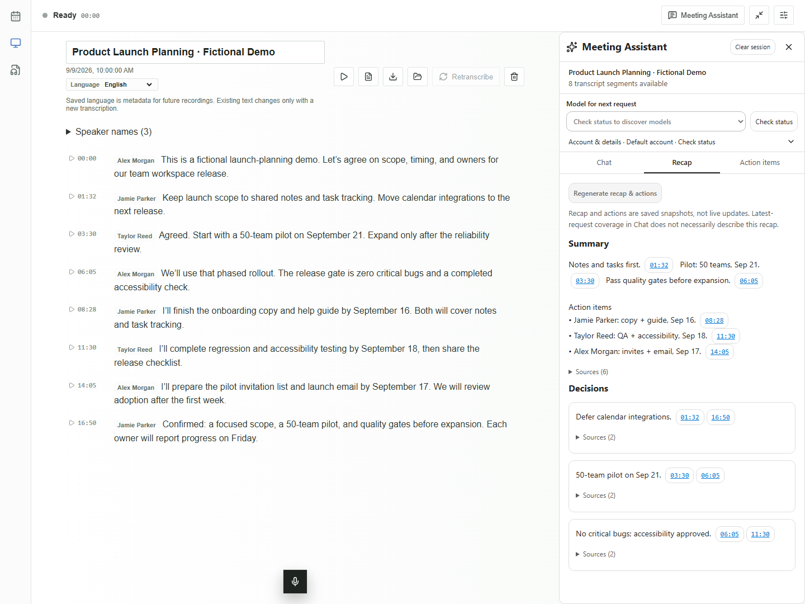
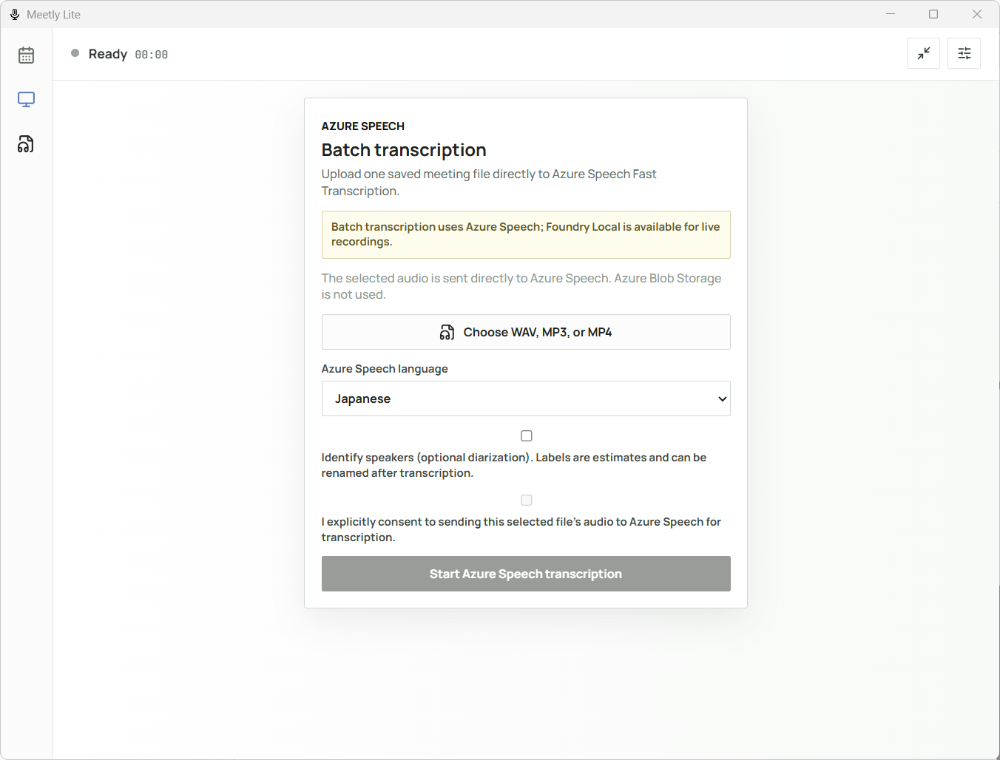
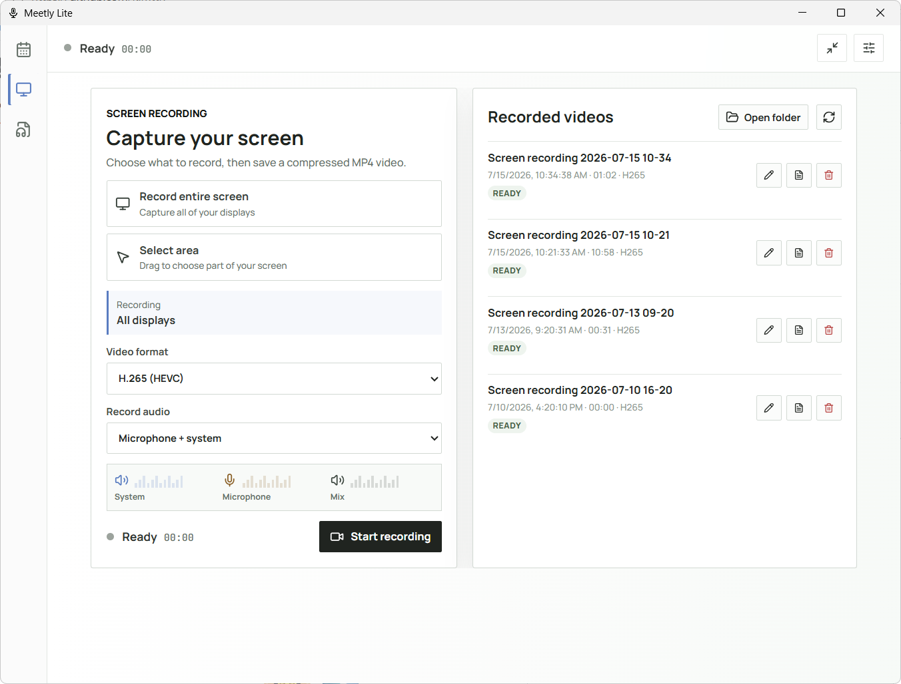

## Meetly Lite

Windows-first **meeting transcription**, **screen recording**, and **Meeting Assistant**. Transcribe on-device with Foundry Local or use optional Azure Speech.

<table>
	<tr>
		<td align="center">
			
		</td>
		<td align="center">
			
		</td>
		<td align="center">
			
		</td>
	</tr>
	<tr>
		<td align="center"><sub>Meeting transcription with Foundry Local or Azure Speech</sub></td>
		<td align="center"><sub>Azure Speech batch transcription for WAV, MP3, and MP4 files</sub></td>
		<td align="center"><sub>Screen recording for an entire display or selected area</sub></td>
	</tr>
</table>

## Start

```powershell
npm install
npm run tauri:dev
```

* Build with `npm run tauri:build`.
* Do not use `npm run dev` for native features.
* Builds prepare FFmpeg 8.1.2 and bundle the Foundry Local runtime.

## Transcription

* **Foundry Local:** prepare a speech model in Settings for on-device transcription.
* **Azure Speech:** sign in with Azure CLI and assign the `Cognitive Services User` role. Supports live transcription and WAV, MP3, or MP4 files up to 250 MB and two hours.
* **Retranscribe:** creates a new meeting, preserving the original audio and text. Optional speaker separation and local speaker names are supported.
* On Windows 11, microphone capture follows the mute state of an available active Teams call.

> Azure Speech uploads audio to the cloud. Use Foundry Local to keep transcription on-device.

## Meeting Assistant

Ask questions during or after recording, generate recaps and action items, and follow timestamped citations back to the recording.

1. Sign in with `gh auth login` using a Copilot-enabled account.
2. Open **Meeting Assistant**. Choose an account under **Account & details** if needed, then click **Check status** and select a model.
3. Ask a question or generate a recap. **Clear session** removes only assistant history, not the recording or transcript.

Powered by GitHub Copilot, not Microsoft 365 Copilot. Generation sends transcript context and conversation history to GitHub; usage charges and organization policies apply. Status checks do not send meeting content. History is saved locally.

## Screen recording

Record a display or selected area to local H.264/H.265 MP4. Choose the output folder in Video settings. To transcribe a saved video, use its transcript icon to upload audio to Azure Speech.

## Development

* Frontend: `npm run build`
* Offline tests: `npm run test:audio` and `npm run test:assistant`
* Rust tests: `cargo test --manifest-path src-tauri/Cargo.toml --lib` from a Visual Studio 2022 x64 Developer Command Prompt.

See [Architecture.md](Architecture.md) for the design and [docs/rust-basic.md](docs/rust-basic.md) for the Rust implementation guide.

### FFmpeg licensing

The bundled FFmpeg 8.1.2 essentials build is static GPLv3 software from Gyan Doshi's Windows builds: <https://github.com/FFmpeg>.
